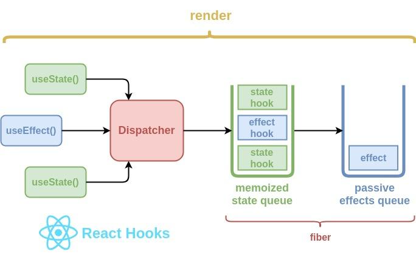

# useState -> [state, setState]
1. Initial state
2. When form is filled then we are updating the state.
3. When signup component useState hook sets the initial state in the memoized state queue
4. 

# useEffect -> (() => {}, [dependencies])
1. Mounting phase
    1. Runs once after the initial render
    2. If dependencies are not provided i.e second argument of useEffect as empty array [].
2. Updating phase
    1. Runs only if dependencies are changed
    2. (() => {}, [emailChanged,passwordChanged])
3. Cleanup phase (optional phase)
    1. If the useEffect() return another function, the function will act as a clean for that effect.
    2. (() => {
        return () => {
            // body for cleanup
        }
    }, [dependencies])
4. Unmounting phase
    1. When component we need to remove from ReactDOM
    2. Any cleanup from the effect runs if defined

    Component mounts
            |
    useEffect initialized
            |
    Effect runs based on dependencies
        Every render (no dependency)
        Once ([emptyArray])
        On dependency change ([specificDependencies])
          |
    Cleanup (if applicable)
        Runs before the next render or unmount
          |
    Component unmount
        Effect cleanup executes if applicable

# Axios
1. Promise based http client for the browser
2. Makes asynchronous http request to REST endpoints and returns a promise (fulfilled, rejected, pending)

    When component renders 
            |
    Component mounts or updates
        -> It may trigger an API call
            |
    Axios request setup
        -> HTTP method (GET, POST,PUT,DELETE etc.)
        -> URL - specifying the endpoint you are trying to reach.
        -> OPTIONS - where request headers, request body, query params etc.
            |
    Sending the axios request
            |
    Server response
        -> Server receives the request, processes it & send back to the client. 
            |
    Handling the response
        -> Axios returns a promise
        -> .then() -> if fulfilled, .catch() => if error occurred
        Promise chaining
            |
    Updating component state
        -> using useState, setState to store the response data inside the component state.
        -> Which re-renders th component with passive effect.
            |
    Error handling
        -> if the server response with error 404,500, etc.
        -> Handle it with try catch

# useForm & useFormState

# intersection observer